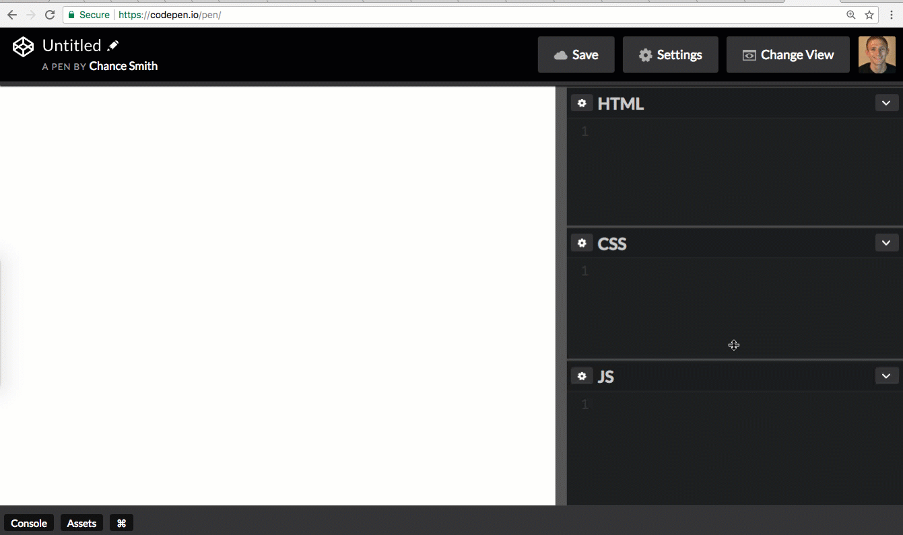
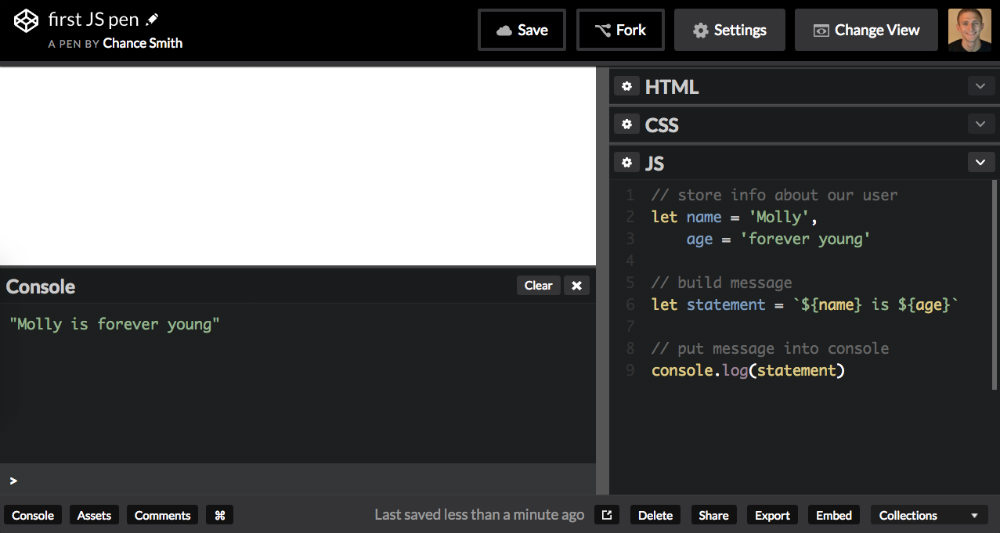

# Let's hit the JS playground

Learn Javascript

## Don't be a noob

Java is not Javascript.
Okay, now you're ready to begin... 😛

## Try JS out

The easiest way to dip your toes in the pool of JS is in a coding fiddle. Let's use [Codepen](codepen.io)

Set up a [new pen in Codepen](codepen.io/pen)

### Steps shown below in GIF

* slide the JS section up
* open the console (bottom left)
* give you pen a name (top left)
* click "Save" ([create your FREE account if you haven't already](https://codepen.io/accounts/signup/user/free))



Copy this code into your new pen in the JS block/section:

```javascript
// store info about our user
let name = "Molly",
  age = "forever young";

// build message
let statement = `${name} is ${age}`;

// put message into console
console.log(statement);
```

Your pen should be look something like this:



## What do we have so far?

### Line 1, we have a comment

```javascript
// store info about our user
```

Comments help give our code context and insight into what is going on. These are messages for all who read the code. Most, if not all coding languages have a way to create comments. It really is helpful as your projects grow.

### Line 2, we have a variable set

```javascript
let name = "Molly",
```

The `name` variable is declared with the `let` statement. `name` is set to equal `"Molly"`. [Why `let`?](https://stackoverflow.com/questions/37916940/why-was-the-name-let-chosen-for-block-scoped-variable-declarations-in-javascri)

`Molly` is a [String](https://developer.mozilla.org/en-US/docs/Web/JavaScript/Reference/Global_Objects/String), a Data Type of chained letters, digits, and puncuation marks. All of the text on this page could also be a very large String.

To make a String, use single or double quotes: `'text here' or "another text here"`

We'll talk about other Data Types later. Let's get on with it. 😄

### Line 3, sets another variable

You can name variables pretty much anything. This next variable is declared with out a `let` statement on the same line. This is possible because of the previous comma. The commas says, "`name` is Molly [and] `age` is forever young".

```javascript
let name = "Molly",
  age = "forever young";
```

We could also do this:

```javascript
let name = "Molly";
let age = "forever young";
```

Both ways work. 👍

### Line 6, sets another variable

```javascript
// build message
let statement = `${name} is ${age}`;
```

The `statement` variable is set to a new string with the other variables, `name` and `age`, in side of back-ticks. This is called interpolation.

We could've also done this:

```javascript
// build message
let statement = name + " is " + age;
```

Both ways combine the strings together. This is called concatenation.

### Line 9, sends a message to the console window

```javascript
// put message into console
console.log(statement);
```

In short, the `console.log()` method allows us to return anything we want to see. We'll play with the console a good bit.

Now, you go get in the driver's seat. 🚗

## Challenges

### Challenge #1

Using the example above, create a new statement that includes a sentence like this:
"NAME is AGE, and likes FRUIT and HOBBY"

Open a new pen, name it `jss0c1` and click Save.
In `challenges/s0c1.js`, paste the link to your new pen.
